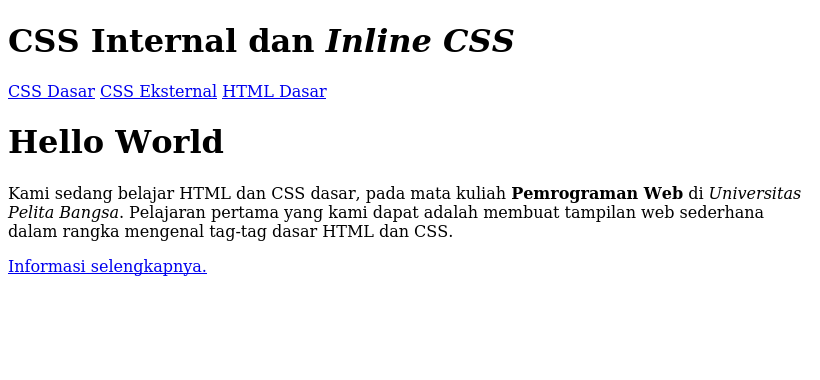
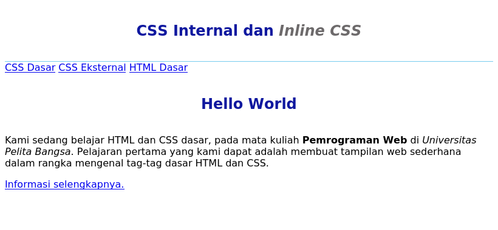
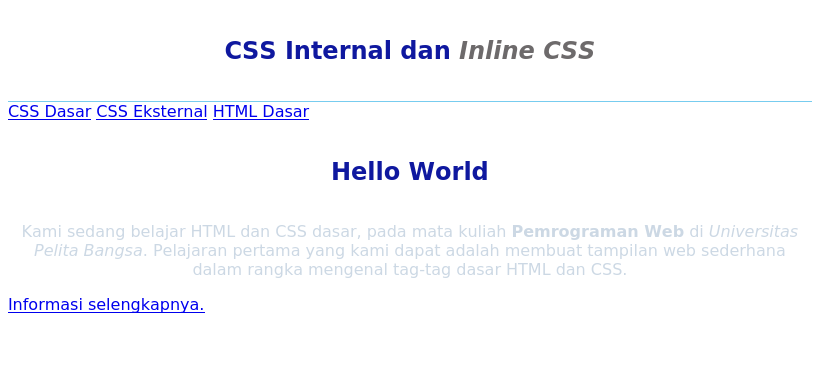
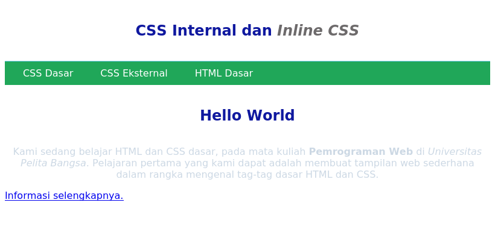
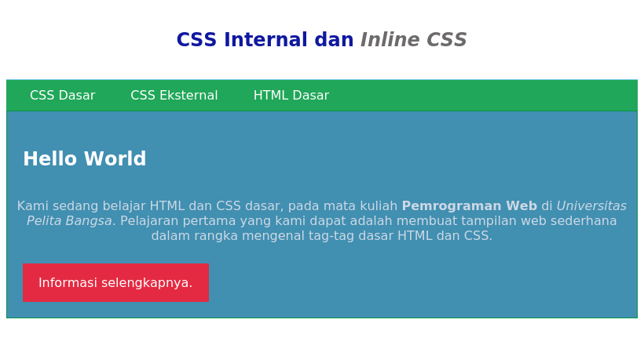
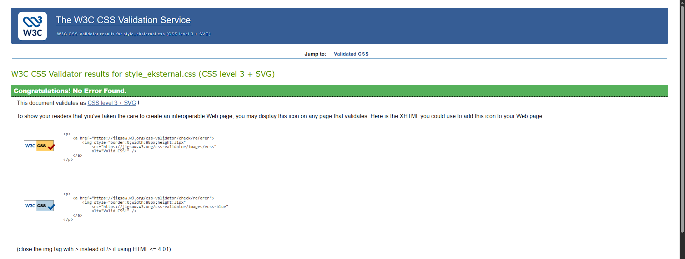
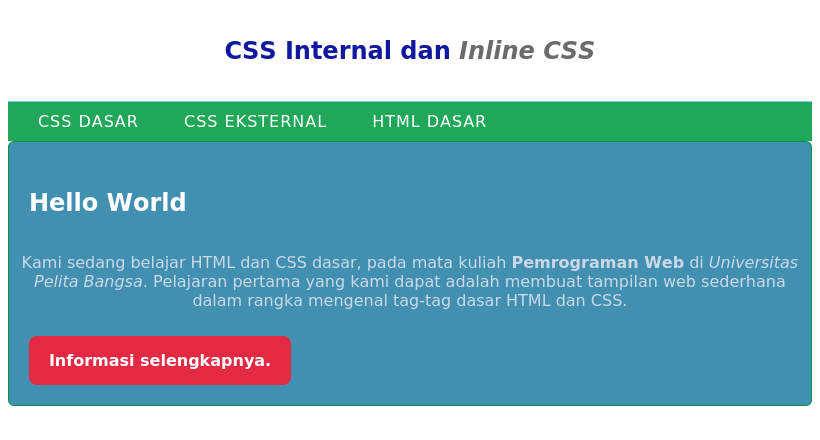
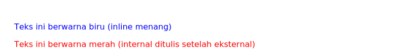
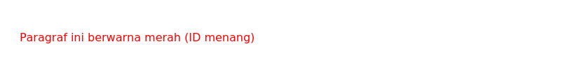

# Lab3Web – Praktikum 3: CSS Dasar

**Mata kuliah:** Pemrograman Web
**Nama:** Muhammad Alghofiqi
**Universitas:** Universitas Pelita Bangsa

## Tujuan

1. Memahami konsep dasar CSS
2. Memahami aturan penulisan CSS
3. Memahami selector sebagai pengontrol CSS
4. Membuat pengaturan CSS pada HTML

## Struktur File

```
Lab3Web/
├── lab2_css_dasar.html
├── style_eksternal.css
├── screenshots/
└── README.md
```

---

## Langkah-Langkah Praktikum

### 1. Membuat Dokumen HTML

Membuat file `lab2_css_dasar.html` berisi struktur dasar HTML: `<header>` dengan judul `h1`, `<nav>` dengan tiga tautan, dan `<div id="intro">` yang berisi heading, paragraf, serta tombol berkelas `button btn-primary`. Pada tahap ini halaman belum diberi CSS sehingga tampil dengan gaya bawaan browser.



### 2. Mendeklarasikan CSS Internal

Menambahkan tag `<style>` di dalam `<head>`. CSS internal mengatur:

- `body` → font `Open Sans`
- `header` → tinggi minimum 80px dan garis bawah biru muda
- `h1` → ukuran 24px, warna `#0F189F`, rata tengah, dan padding
- `h1 i` → teks miring berwarna abu-abu `#6d6a6b`

Hasilnya, judul menjadi biru tua dan rata tengah, dengan teks *Inline CSS* berwarna abu-abu.



### 3. Menambahkan Inline CSS

Menambahkan atribut `style="text-align: center; color: #ccd8e4;"` pada tag `<p>`. Inline CSS hanya berlaku pada satu elemen tersebut, sehingga paragraf menjadi rata tengah dengan warna biru keabu-abuan yang pucat.



### 4. Membuat CSS Eksternal

Membuat file `style_eksternal.css` berisi gaya untuk `nav`, `nav a`, serta `nav .active` dan `nav a:hover`. File ini dihubungkan ke HTML dengan tag `<link rel="stylesheet" href="style_eksternal.css" type="text/css">` di dalam `<head>`. Menu navigasi kini berlatar hijau dengan teks putih, dan berubah warna ketika di-hover.



### 5. Menambahkan CSS Selector (ID dan Class)

Pada `style_eksternal.css` ditambahkan:

- **ID selector** `#intro` dan `#intro h1` → blok intro berlatar biru, dan heading di dalamnya rata kiri berwarna putih.
- **Class selector** `.button` dan `.btn-primary` → tautan tampil seperti tombol, dengan `.btn-primary` memberi warna latar merah.



### 6. Validasi CSS

Memvalidasi `style_eksternal.css` melalui <https://jigsaw.w3.org/css-validator/>.



---

## Pertanyaan dan Tugas

### 1. Eksperimen properti CSS

Contoh perubahan yang ditambahkan pada `style_eksternal.css` (sesuaikan dengan CSS Cheat Sheet):

```css
/* Eksperimen */
.button {
    border-radius: 8px;
    font-weight: bold;
    transition: background 0.3s;
}
.button:hover {
    background: #b01e32;
}
nav a {
    text-transform: uppercase;
    letter-spacing: 1px;
}
#intro {
    border-radius: 6px;
}
```

Penjelasan: `border-radius` membuat sudut membulat, `font-weight` menebalkan teks, `transition` menghaluskan perubahan warna saat hover, `text-transform` mengubah huruf menjadi kapital, dan `letter-spacing` mengatur jarak antarhuruf.



### 2. Perbedaan `h1 { ... }` dengan `#intro h1 { ... }`

- `h1 { ... }` adalah **element selector**. Aturannya berlaku untuk **semua** elemen `<h1>` di seluruh halaman.
- `#intro h1 { ... }` adalah **descendant selector** (selector turunan). Aturannya hanya berlaku untuk elemen `<h1>` yang berada **di dalam elemen ber-id `intro`**.
- `#intro h1` juga memiliki **specificity lebih tinggi** (mengandung 1 id + 1 elemen) dibanding `h1` (hanya 1 elemen), sehingga jika keduanya bentrok, `#intro h1` yang dipakai.

Pada praktikum ini, `h1` di dalam `<header>` mengikuti aturan `h1` (rata tengah, biru tua), sedangkan `h1` "Hello World" di dalam `#intro` memakai aturan `#intro h1` (rata kiri, putih, tanpa border).

### 3. Internal, eksternal, dan inline CSS pada elemen yang sama

**Yang tampil di browser adalah inline CSS.** Urutan prioritasnya:

1. **Inline CSS** (atribut `style` pada tag), paling tinggi
2. **Internal dan eksternal CSS**, specificity-nya setara, sehingga yang **dituliskan paling akhir** di dokumen yang dipakai (aturan *cascade*)

Contoh:

```html
<head>
    <link rel="stylesheet" href="style.css">   <!-- p { color: green; } -->
    <style>
        p { color: red; }                      /* internal */
    </style>
</head>
<body>
    <p style="color: blue;">Teks ini berwarna biru</p>
    <p>Teks ini berwarna merah</p>
</body>
```

- Paragraf pertama berwarna **biru** karena inline mengalahkan yang lain.
- Paragraf kedua berwarna **merah**, karena internal ditulis setelah `<link>` eksternal. Jika posisinya ditukar (`<style>` dulu, baru `<link>`), warnanya menjadi **hijau**.

(Pengecualian: deklarasi dengan `!important` akan mengalahkan inline.)



### 4. ID dan Class pada satu elemen

**Yang tampil adalah deklarasi ID selector**, karena specificity ID lebih tinggi daripada class, tidak peduli mana yang ditulis lebih dulu atau lebih akhir. Urutan specificity: inline > ID > class > elemen.

Contoh:

```html
<p id="paragraf-1" class="textparagraf">Paragraf ini berwarna merah</p>
```

```css
#paragraf-1 {
    color: red;
}
.textparagraf {
    color: green;
}
```

Hasilnya, teks berwarna **merah** karena `#paragraf-1` (ID) lebih kuat daripada `.textparagraf` (class). Properti yang tidak bentrok tetap digabungkan, misalnya jika `.textparagraf` juga mengatur `font-size`, ukuran tersebut tetap berlaku.



---

## Kesimpulan

CSS dapat ditulis dengan tiga cara (inline, internal, eksternal), dan penggunaan CSS eksternal paling efisien karena satu file dapat dipakai banyak halaman. Selector (elemen, class, id) menentukan elemen mana yang terkena gaya, sedangkan prioritas ditentukan oleh *specificity* dan urutan penulisan (*cascade*).
